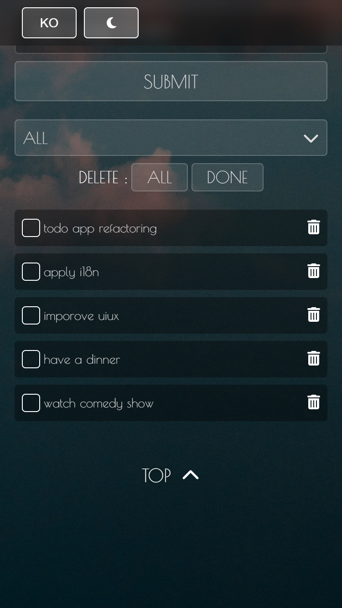

<h1 align="center">✨ Vue Todo App ✨</h1>

  A beautifully refined Todo Application featuring Light/Dark themes, i18n, animations, and clean Vue 3 architecture.

  

# Vue Todo App

A clean, modern, multi-language (EN/KR) Todo application built with **Vue.js 3**, **SCSS**, and refined UI/UX patterns.

### 🌍 English | 🇰🇷 한국어 아래에 있습니다.

---

# 🖥 Full Screen Preview

### Desktop

### Mobile

---

# 🌍 English Version

## 🚀 Demo

**Live Demo:** https://woojin966.github.io/vueTodoApp/

---

## 📌 Overview

This project is a fully restructured Todo App built using **Vue 3 + Composition API**, showcasing clean architecture and professional UI/UX polish suitable for international freelance work.

  
  
  
  
  
  
  

### Included:

- Modular component architecture
- Reusable composables
- Light/Dark theme mode
- English/Korean language toggle
- Smooth fade-in & scroll animations
- LocalStorage persistence
- Fully responsive layout

This project serves as part of my portfolio for global clients.

---

## ✨ Features

### ✔ Todo Features

- Add / delete / complete tasks
- Delete all / delete completed
- "Load More" for progressive list
- LocalStorage persistence
- Reusable composable: `useTodos()`

### ✔ UI/UX

- Light & Dark themes
- Fade-in scroll animations
- Vue transition-group animations
- Glassmorphism-inspired UI
- SCSS Design Tokens (variables + mixins)
- Responsive for desktop / tablet / mobile

### ✔ Internationalization (i18n)

- English / Korean support
- Language toggle with vue-i18n
- Default language: **English**

---

## 🧩 Tech Stack

| Category     | Technology                            |
| ------------ | ------------------------------------- |
| Framework    | Vue.js 3 (Composition API)            |
| Styling      | SCSS Modules, Variables, Mixins       |
| Animations   | CSS Transitions, IntersectionObserver |
| I18n         | Vue I18n                              |
| Icons        | Font Awesome                          |
| Deployment   | GitHub Pages                          |
| External API | Unsplash (random background image)    |

---

## 🗂 Project Structure

src/  
├─ components/  
│ ├─ HeaderBar.vue  
│ ├─ TodoInput.vue  
│ ├─ TodoList.vue  
│ ├─ TodoFilter.vue  
│ ├─ DeleteControls.vue  
│ └─ TimeDateSection.vue  
│  
├─ composables/  
│ ├─ useTodos.js  
│ └─ useFadeIn.js  
│  
├─ locales/  
│ ├─ en.json  
│ ├─ ko.json  
│  
├─ styles/  
│ ├─ main.scss  
│ ├─ variables.scss  
│ ├─ mixins.scss  
│ ├─ todoInput.scss  
│ ├─ todoList.scss  
│ ├─ todoFilter.scss  
│ ├─ deleteControls.scss  
│ └─ headerBar.scss  
│  
└─ App.vue

---

## 🔧 Setup & Installation

\`\`\`bash
git clone https://github.com/woojin966/vueTodoApp.git
cd vueTodoApp
npm install
npm run dev
npm run build
\`\`\`

---

## 📸 Screenshots

### 🌞 Light Mode

### 🌙 Dark Mode

---

## 📱 Mobile

### 🌞 Mobile — Light Mode

### 🌙 Mobile — Dark Mode

---

## 📬 Contact

For business inquiries or collaboration:

- **Email:** woojin_966@naver.com
- **Portfolio:** https://woojin966.github.io/portfolid2025/
- **GitHub:** https://github.com/woojin966

---

## 📝 License

This project was developed solely for **personal portfolio and educational use**.
Commercial use or redistribution is **not permitted**.

---

# 🇰🇷 한국어 버전

## 🚀 데모

실행 페이지: https://woojin966.github.io/vueTodoApp/

---

## 📌 개요

Vue 3 + Composition API 기반으로 제작한 Todo 애플리케이션입니다.
컴포넌트 구조화, SCSS 디자인 시스템, 반응형, 다크모드, 다국어 등
프론트엔드 핵심 역량을 보여주는 포트폴리오 프로젝트입니다.

### 포함 기능:

- 컴포넌트 구조 정리
- SCSS 기반 디자인 시스템
- 다크/라이트 테마
- 영어/한국어 토글
- 스크롤 페이드 애니메이션
- LocalStorage 데이터 유지
- 모바일/데스크탑 반응형 UI

---

## ✨ 주요 기능

### ✔ Todo 기능

- 등록 / 완료 / 삭제
- 전체 삭제 / 완료 항목 삭제
- “더보기” 로딩
- LocalStorage 저장

### ✔ UI/UX

- 부드러운 fade-in 애니메이션
- transition-group
- 글래스모피즘 UI
- 반응형 레이아웃
- Poiret One / Pretendard 폰트

### ✔ 다국어 (i18n)

- vue-i18n 적용
- EN ↔ KO 즉시 전환

---

## 🧩 기술 스택

| 구분       | 기술                                 |
| ---------- | ------------------------------------ |
| 프레임워크 | Vue.js 3 (Composition API)           |
| 스타일     | SCSS, Design Tokens                  |
| 애니메이션 | CSS Transition, IntersectionObserver |
| 국제화     | Vue I18n                             |
| 아이콘     | Font Awesome                         |
| 배포       | GitHub Pages                         |
| API        | Unsplash API                         |

---

## 🔧 설치 및 실행

    git clone https://github.com/woojin966/vueTodoApp.git
    cd vueTodoApp
    npm install
    npm run dev
    npm run build

---

## 📬 연락처

협업 및 문의:

- Email: woojin_966@naver.com
- 포트폴리오: https://woojin966.github.io/portfolid2025/
- GitHub: https://github.com/woojin966

---

## 📄 라이선스

본 프로젝트는 **개인 포트폴리오 및 교육용**으로 제작되었습니다.
상업적 사용 또는 재배포는 불가합니다.

---

## 📦 GitHub Pages Deployment Guide

This project is deployed using **GitHub Pages**.  
To deploy your own version, follow these steps:

### 1. Clone the repository

\`\`\`bash
git clone https://github.com/woojin966/vueTodoApp.git
cd vueTodoApp
\`\`\`

### 2. Install dependencies

\`\`\`bash
npm install
\`\`\`

### 3. Build for production

\`\`\`bash
npm run build
\`\`\`

This will generate the `dist/` folder.

### 4. Deploy to GitHub Pages

1. Go to **Settings → Pages**
2. Under **Build and Deployment**, choose:
   - **Source**: Deploy from branch
   - **Branch**: `main`
   - **Folder**: `/ (root)`
3. Save the settings

### 5. Automatic Deployment

Once you push changes to `main`, GitHub Pages will automatically rebuild and update your deployed site within **30–60 seconds**.

### ✔ Live URL Example

https://woojin966.github.io/vueTodoApp/
